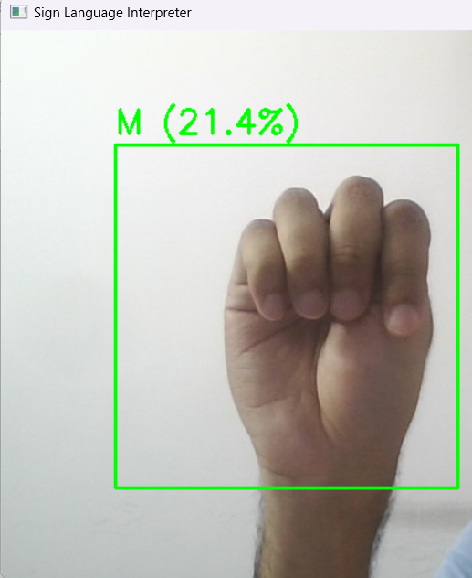
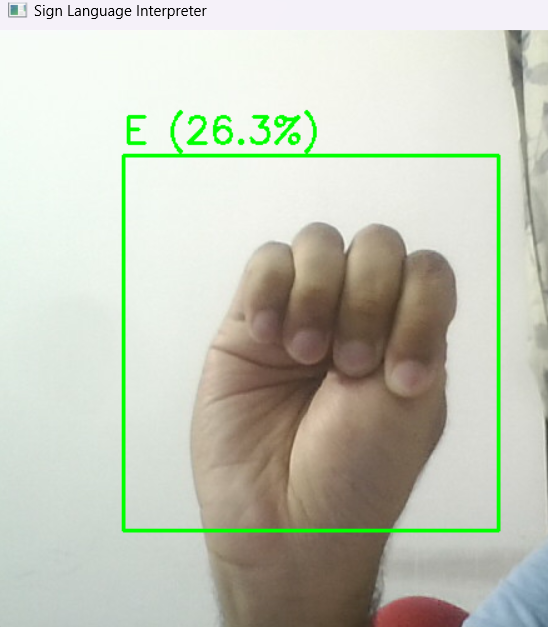
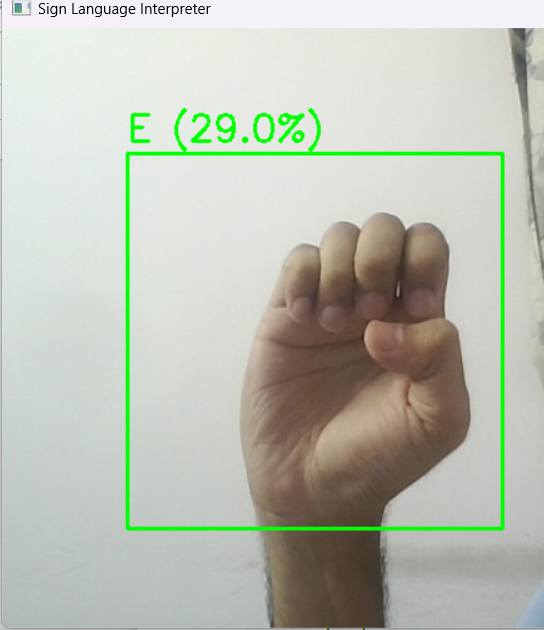
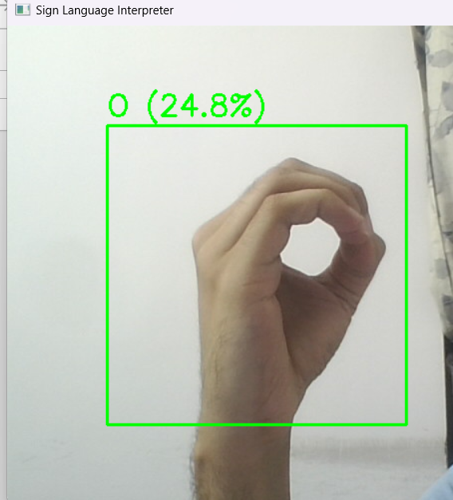
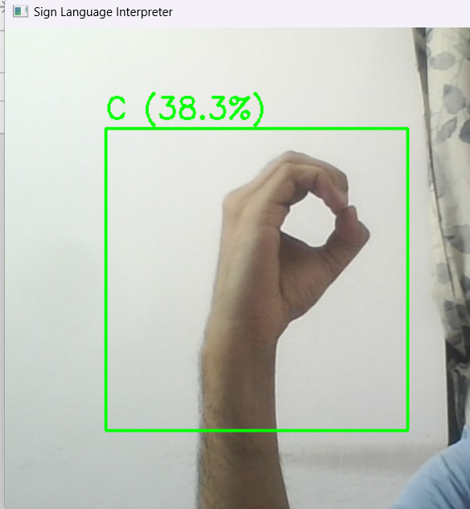
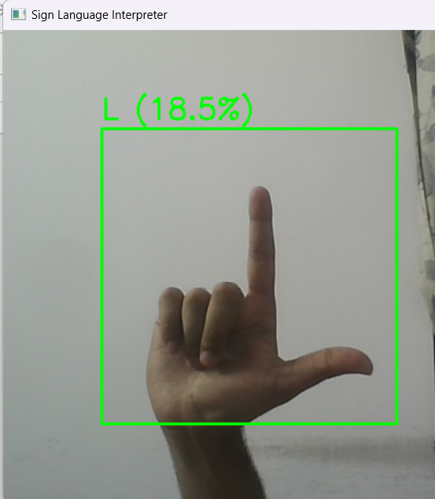

# Sign Language Detector

An AI-powered real-time sign language recognition system that detects numbers (0-9) and letters (A-Z) using a webcam feed.

## Features
- Detects numbers (0-9) and alphabets (A-Z) in real-time.
- Live webcam interface with bounding box visualization.
- Trained with a deep learning model using **MobileNetV2** in PyTorch.

## Installation

1. Clone the repository:
```bash
git clone https://github.com/MShaheerMalik77/Realtime-SignLanguage-Interpreter.git
cd Realtime-SignLanguage-Interpreter
````

2. Install dependencies:

```bash
pip install -r requirements.txt
```

3. Place the trained model file (`best_sign_model2.pth`) in the project directory.

4. Run the webcam detection:

```bash
python webcam_inference.py
```

## Model Training

The model was trained using **MobileNetV2** in PyTorch. Training code is available in `train_model.ipynb`.

## Screenshots

Here's some outputs from the model via webcam. It still shows some inaccuracies, such as mistaking "O" for "C" and "M" for "E":








## Tech Stack

* Python
* PyTorch
* OpenCV
* Torchvision
* Jupyter Notebook

````

